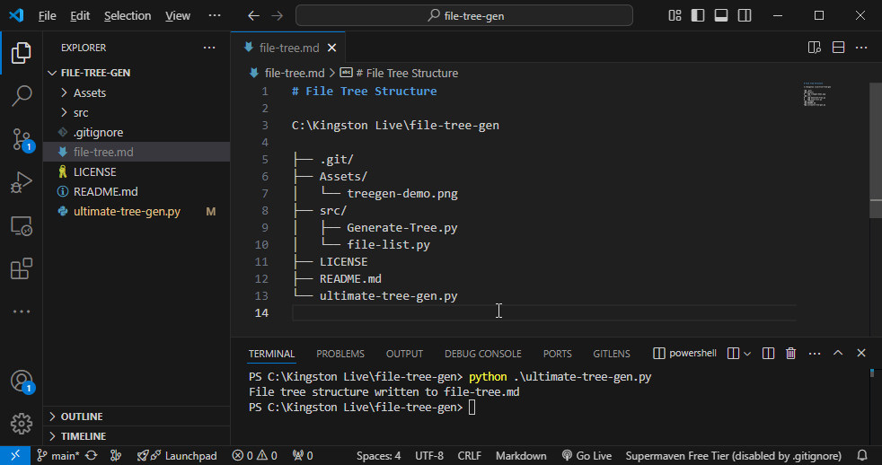

# Ultimate File Tree Generator



## Description

`ultimate-tree-gen` is a (customizable) python script that traverses a project directory and generate a structured file tree in Markdown format. It saves users looking to textually represent their project's file tree ample time and effort. The generated tree is copiable and can then be used anywhere, for any purporse.

## Features

- **Customizable Exclusion**: Easily configure directories to exclude from the file tree generation process, with options to exclude entire directories or just subdirectories.
- **Dynamic Path Generation**: It knows your project root directory and crawls the directory tree to generate paths dynamically..
- **Markdown Output**: Outputs a neatly formatted Markdown file representing the project structure.
- **Cross-Platform Compatibility**: Works on any operating device that supports python.

- Generates a visual representation of the directory structure.
- Excludes specified directories.

## Requirements

- Python 3.x

## Usage

1. Clone the repository:

   ```bash
   git clone https://github.com/kingstondoesit/file-tree-gen.git
   ```

2. Navigate to the project directory:

   ``` bash
   cd file-tree-gen
   ```

3. Run the script:

   ``` bash
   python ultimate-tree-gen.py
   ```

4. The script generates a Markdown file named `file-tree.md` in the root directory with the directory location and a hierachical representation of the project's file structure.

## Customizable Options

- `--root`: Specify the root directory of the project. Defaults to the current working directory.
- `--exclude`: Specify directories to exclude from the file tree generation process. Separate multiple directories with commas. Defaults to `.venv` and `.vscode`.
- `--exclude-entire-dirs`: Exclude entire directories instead of just their subdirectories. Defaults value is set to `True`.

## Contributing

Contributions are welcome! If you find a bug or have a suggestion for improvement, please open an issue or submit a pull request on the GitHub repository.

1. Fork the repository.

2. Create a new branch for your changes.

   ``` bash
   git checkout -b <your-branch-name>
   ```

3. Make your changes and commit them with a commit message.

   ``` bash
   git commit -m "Added a new feature"
   ```

4. Push your changes to your forked repository

   ``` bash
   git push origin <your-branch-name>

   ```

5. Create a pull request to the main repository.

## License

This project is licensed under the MIT License. See the [LICENSE](https://opensource.org/license/MIT) file for details.
